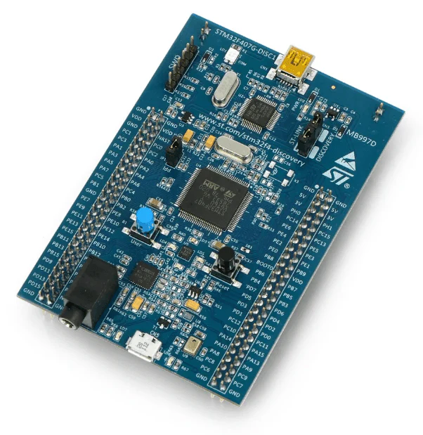
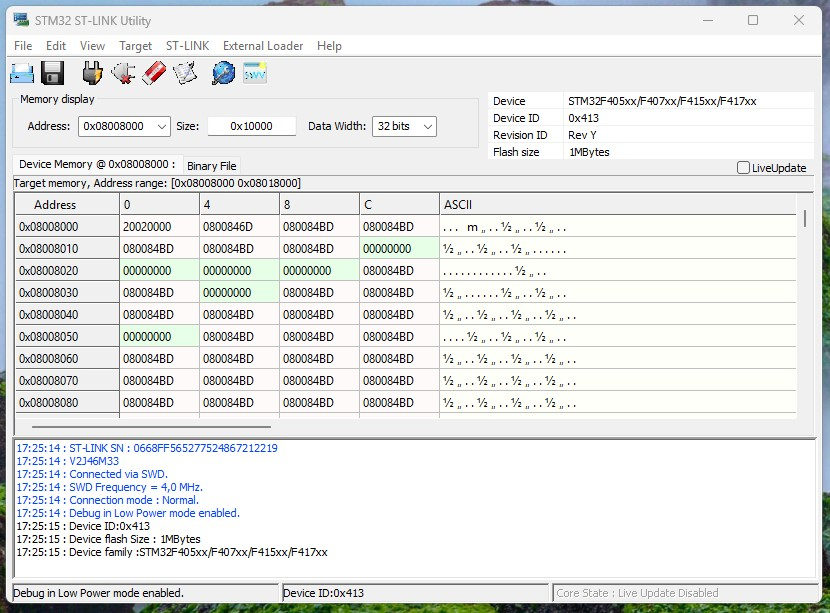

# STM32F407G-DISC1 bare metal bootloader

  
  

Welcome to my STM32 project. I have always wondered what happens under the HAL library function calls, or the pin assignements in the STMCubeIDE. The best way to learn is to manipulate the registers manually, reading the reference manual, find the registers addresses and understand what each bit in the register is for. 
We have built a bootloader that allows us to write code to memory, erase memory, jump to user application code, and using CRC hardware verification for integrity. 
We converted the ".elf" binary file into a ".bin" file to test the memory write funcionality.  
We used the STM32 ST-LINK Utility to view the memory and make sure when it is written of deleted.  

  

The host code executed on the computer can be found in :  https://github.com/niekiran/BootloaderProjectSTM32  

  

